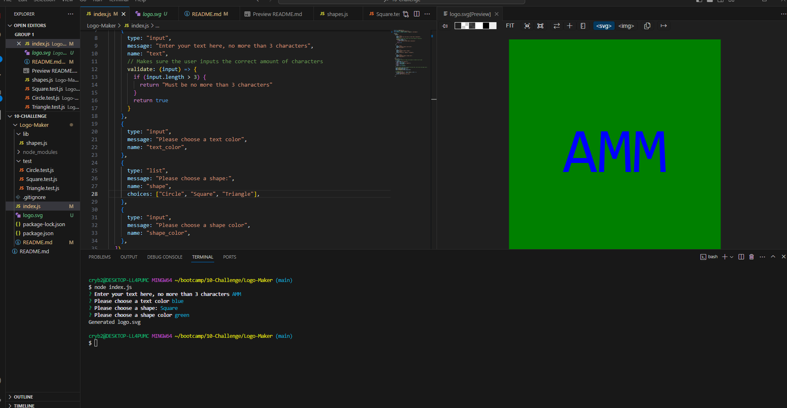

# Logo-Maker

## Description
This project creates a logo via node.js. It takes in four values of user input (text, text color, shape, and shape color) and creates an SVG based on this input. There are also tests run for each shape. I was responsible for all code in this project, including installing all required modules and creating the tests.

## Usage
Here is the link for the walk-through video:
https://drive.google.com/file/d/105N0-qTcXieaR8EKz7I4Ia-CrEUKVCUF/view

